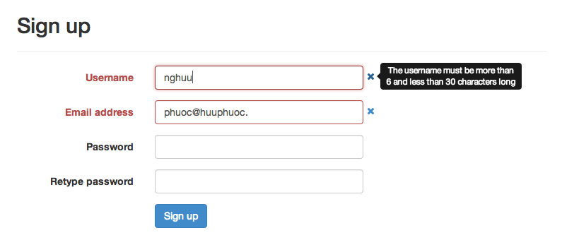

# BootstrapValidate

A jQuery plugin to validate form fields. Use with Bootstrap 3

The plugin uses [Bootstrap Tooltip](http://getbootstrap.com/javascript/#tooltips) to show the error message as following screenshot:



## Required

* [jQuery](http://jquery.com/)
* [Bootstrap 3](http://getbootstrap.com/)

## Build

BootstrapValidate uses [grunt](http://gruntjs.com) to simplify building process.

From the BootstrapValidate root directory, execute the following commands to install the dependent packages (the administrator permission might be required):

```bash
$ npm install grunt --save-dev
$ npm install grunt-contrib-concat --save-dev
$ npm install grunt-contrib-uglify --save-dev
```

Then, uses grunt to build:

```bash
$ grunt
```

The generated scripts (including source and compressed versions) are placed inside the ```dist``` directory.

## Author

Nguyen Huu Phuoc ([Email](mailto: phuoc@huuphuoc.me) / [Twitter](http://twitter.com/nghuuphuoc) / [Github](http://github.com/nghuuphuoc))

## License

Copyright (c) 2013 Nguyen Huu Phuoc

BootstrapValidate is licensed under the MIT license.